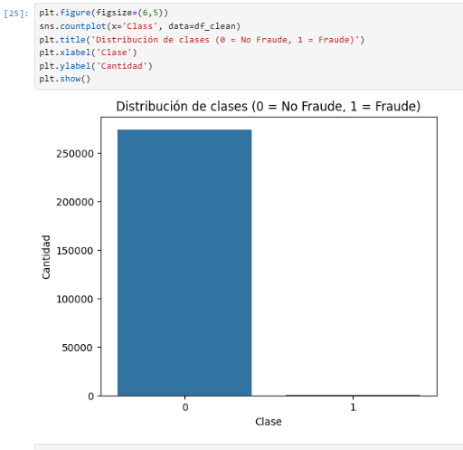
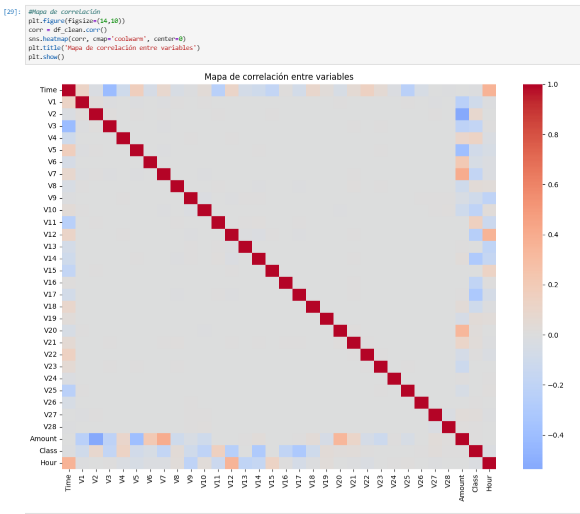
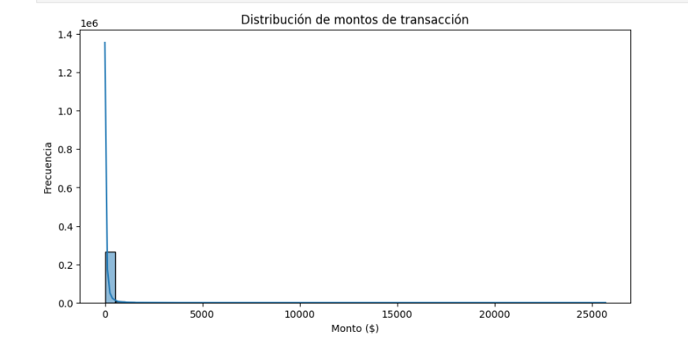
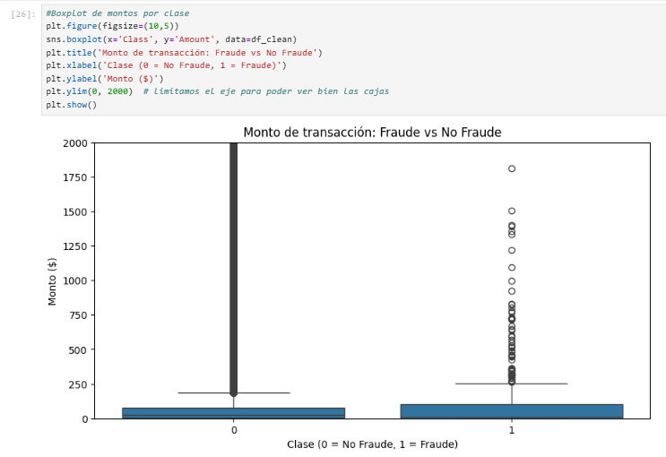
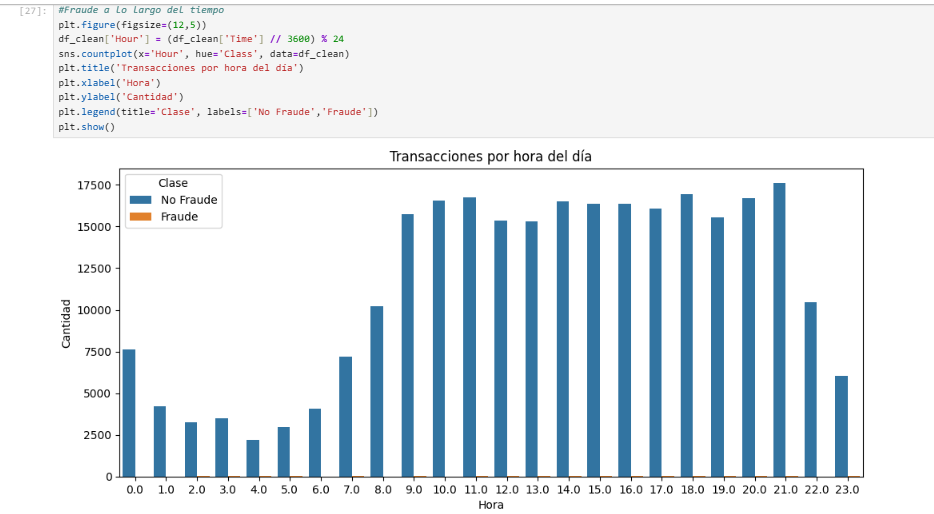
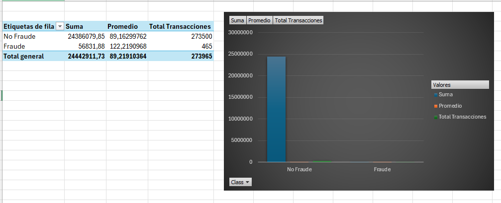
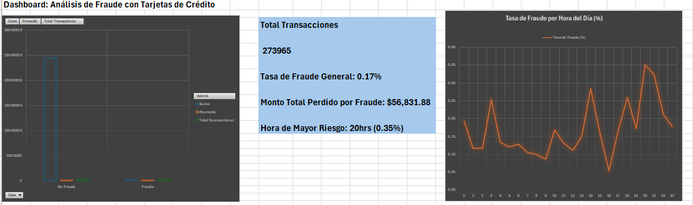
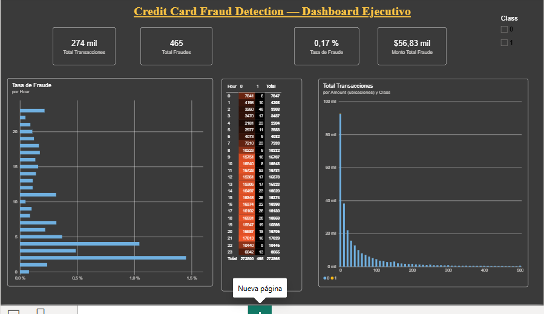
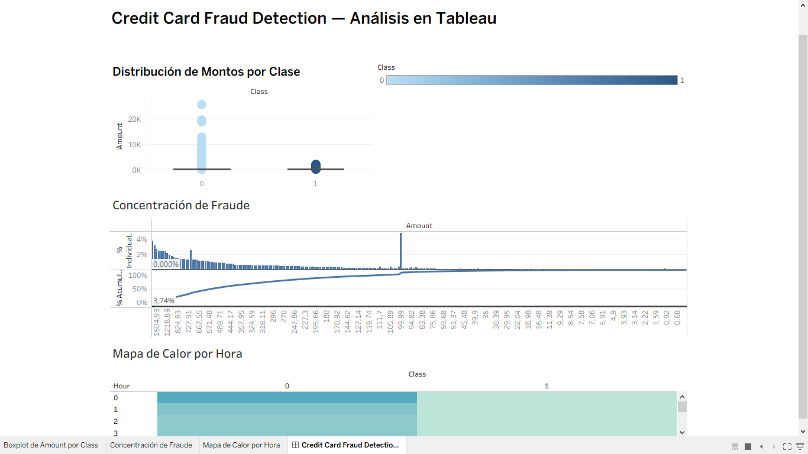
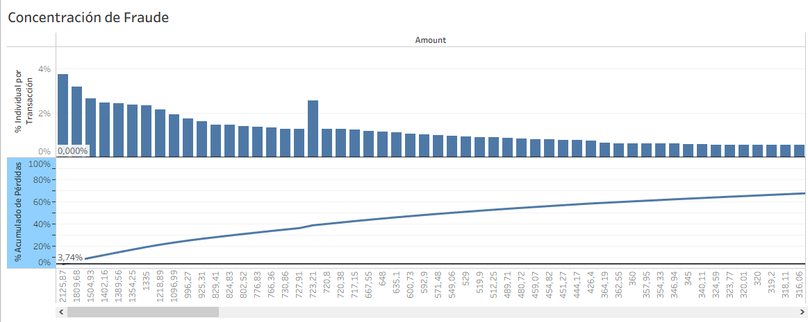

# Credit Card Fraud Detection

Análisis end-to-end de detección de fraude en transacciones con tarjeta de crédito, construido como proyecto de portafolio de Data Analyst. El proyecto recorre el pipeline completo de análisis de datos: limpieza y exploración en **Python**, modelado y consultas analíticas en **PostgreSQL**, y visualización de negocio en **Excel**, **Power BI** y **Tableau**, con el objetivo de identificar patrones de comportamiento fraudulento y validar los hallazgos de forma cruzada entre herramientas.

**Dataset:** [Credit Card Fraud Detection (Kaggle / ULB)](https://www.kaggle.com/datasets/mlg-ulb/creditcardfraud) — 273,965 transacciones después de limpieza (se eliminó 1 fila con nulos y 1,026 duplicados de un total original de 274,992 filas).

**Stack utilizado:** Python (Pandas, Matplotlib/Seaborn) · PostgreSQL 17 · Excel (Power Query, Tablas Dinámicas) · Power BI (DAX) · Tableau Public

---

## 📂 Estructura del repositorio

```
├── data/                    # Datos crudos y procesados (no incluidos, ver sección "Cómo reproducir")
├── notebooks/01_eda.ipynb   # Limpieza y análisis exploratorio en Python
├── sql/                     # Scripts de creación de tabla y consultas analíticas
├── excel/                   # Dashboard en Excel con tablas dinámicas y KPIs
├── powerbi/                 # Dashboard en Power BI con medidas DAX
├── tableau/                 # Dashboard en Tableau (boxplot, Pareto, mapa de calor)
└── images/                  # Capturas de cada dashboard y gráfico del EDA
```

---

## 🐍 1. Python — Limpieza y EDA

Se realizó la limpieza del dataset original (274,992 → 273,965 filas) y un análisis exploratorio completo: distribución de clases, distribución y boxplot de montos por clase, transacciones por hora del día, y mapa de correlación entre variables.

**Hallazgos:**
- Fuerte desbalance de clases: **99.82% no fraude vs 0.18% fraude** (~480 casos).
- El monto (`Amount`) y la hora (`Hour`) tienen correlación casi nula con el fraude de forma individual — no son buenos predictores por sí solos.
- Las variables con mayor correlación con el fraude son **V17, V14, V12** (correlación negativa) y **V11, V4** (correlación positiva) — componentes de PCA que capturan patrones de comportamiento no directamente interpretables.
- Las transacciones fraudulentas tienden a tener montos más comprimidos (menos outliers extremos) que las transacciones normales.

| Distribución de clases | Mapa de correlación |
|---|---|
|  |  |

| Distribución de montos | Boxplot montos por clase | Transacciones por hora |
|---|---|---|
|  |  |  |

---

## 🗄️ 2. PostgreSQL — Análisis con SQL

Base de datos `creditcard_fraud`, tabla `transactions` (31 columnas: `time_seconds`, `v1`–`v28`, `amount`, `class`). Se ejecutaron 7 consultas analíticas (`sql/02_fraud_analysis_queries.sql`) para cuantificar el comportamiento del fraude.

**Hallazgos:**
- Tasa de fraude general: **99.83% no fraude vs 0.17% fraude** (465 casos).
- Monto promedio: **$89.16** no fraude vs **$122.22** fraude.
- Monto máximo: **$25,691** no fraude vs solo **$2,125** fraude.
- Mediana: **$22.50** no fraude vs **$1.00** fraude — el fraude es bimodal: muchos montos muy bajos ("de prueba") y algunos altos.
- Hora de mayor riesgo (basado en `time_seconds / 3600 % 24`): **hora 2 (1.45%)**, hora 4 (1.04%), hora 3 (0.49%).
- Concentración de pérdidas: el **10%** de fraudes más grandes representa el **62.9%** del monto total perdido; el **20%** representa el **82.7%** (patrón 80/20).

---

## 📊 3. Excel — Dashboard con Tablas Dinámicas

Datos cargados vía Power Query, corrigiendo la configuración regional a "Inglés (EE.UU.)" para el separador decimal (el Excel en español interpreta la coma como decimal, lo cual rompía los valores de `Amount` importados desde el CSV). Se creó una columna calculada `Hour` con la fórmula `=RESIDUO(ENTERO(A2/3600);24)`, dos tablas dinámicas (Fraude vs No Fraude con suma/promedio/conteo, y Fraude por hora) y un dashboard con 2 gráficos + KPIs.

**Hallazgos:**
- Réplica de los indicadores generales de fraude vs no fraude (monto, conteo) consistente con SQL.
- ⚠️ **Discrepancia detectada:** al calcular la hora de mayor riesgo, Excel arrojó como resultado las horas **20 (0.35%)** y **14 (0.28%)**, resultados distintos a los obtenidos en SQL y Power BI (hora 2, 4, 3). Se documenta como limitación conocida — la causa más probable es un error en la fórmula de la columna calculada o en cómo la tabla dinámica agregó los datos. Ver sección "Hallazgos clave" para más contexto sobre por qué esto es, en sí mismo, un hallazgo valioso del proyecto.

| Dashboard Excel — Vista 1 | Dashboard Excel — Vista 2 |
|---|---|
|  |  |

---

## ⚡ 4. Power BI — Dashboard con DAX

Conectado vía CSV (corrigiendo configuración regional a inglés en Power Query). Se crearon 7 medidas DAX (Total Transacciones, Total Fraudes, Tasa de Fraude, Monto Promedio, Monto Promedio Fraude/No Fraude, Monto Total Fraude) y una columna calculada `Hour = MOD(INT(Time/3600), 24)`. Dashboard con 4 tarjetas KPI, gráfico de tasa de fraude por hora, histograma de `Amount`, matriz/mapa de calor Hour × Class y segmentador de Class.

**Hallazgos:**
- Total de transacciones analizadas: **273,965**.
- Total de fraudes detectados: **465** (tasa de fraude: **0.17%**).
- Monto total perdido por fraude: **$56,830** (~$56.83 mil).
- Monto promedio: **$89.16** no fraude vs **$122.22** fraude (confirmado vía SQL).
- **Hora de mayor riesgo: hora 2**, con una tasa de fraude relativa de **1.45%** (48 casos de fraude sobre 3,308 transacciones totales en esa franja, representando $3.75 mil en pérdidas). Este resultado **coincide exactamente con el cálculo en SQL**, validando de forma cruzada ambas herramientas — y contrastando con la discrepancia detectada en Excel.



---

## 📉 5. Tableau — Dashboard Visual

Conectado vía CSV en Tableau Public (PostgreSQL no disponible en la versión gratuita), corrigiendo configuración regional (inglés EE.UU.) y separador de campos. Dashboard armado combinando tres hojas: boxplot de `Amount` por clase, gráfico de concentración de fraude tipo Pareto, y mapa de calor Hour × Class.

**Hallazgos:**
- **Boxplot de montos por clase:** la mediana de las transacciones no-fraude es de aproximadamente **$23**, con cuartil inferior de $6 y cuartil superior de $78 (bigote superior en $187 antes de considerarse outlier). Confirma visualmente que el fraude opera con montos sistemáticamente menores y más comprimidos que las transacciones legítimas.
- **Curva de Pareto:** el fraude individual más grande representa por sí solo cerca del **4%** del monto total perdido por fraude. La curva de porcentaje acumulado confirma el patrón 80/20 ya identificado en SQL (10% de fraudes = 62.9% del monto perdido; 20% = 82.7%).
- **Mapa de calor Hour × Class:** confirma visualmente que el volumen de transacciones no-fraude domina ampliamente sobre el de fraude en todas las horas del día (273,965 vs 465), con un patrón horario de actividad claramente distinto entre madrugada (menor actividad) y horas diurnas/nocturnas de mayor tráfico.

| Dashboard Tableau | Detalle |
|---|---|
|  |  |

---

## 🔑 Hallazgos clave

1. **El fraude es extremadamente raro (0.17%) pero de patrón distintivo:** montos bajos y concentrado en horas de madrugada, con pico en la hora 2 — validado de forma cruzada en SQL y Power BI.
2. **El fraude sigue un patrón de concentración tipo 80/20:** una fracción pequeña de los casos de mayor monto explica la mayoría de las pérdidas totales (10% de fraudes = 62.9% del monto perdido; 20% = 82.7%).
3. **La validación cruzada entre herramientas fue consistente** en los hallazgos principales (SQL, Power BI y Tableau coinciden), con la excepción de Excel, cuya discrepancia en el análisis por hora quedó documentada como limitación/lección aprendida — un ejemplo real de por qué la validación cruzada entre herramientas es una práctica valiosa en el análisis de datos, y de cómo un mismo cálculo puede arrojar resultados distintos según cómo se implemente en cada plataforma.

---

## 🔁 Cómo reproducir este proyecto

Los archivos de datos (`creditcard.csv` y `creditcard_clean.csv`) no están incluidos en este repositorio por su tamaño (>100MB). Para reproducir el análisis:

1. Descargar el dataset original desde [Kaggle — Credit Card Fraud Detection (ULB)](https://www.kaggle.com/datasets/mlg-ulb/creditcardfraud).
2. Colocarlo en `data/raw/creditcard.csv`.
3. Ejecutar `notebooks/01_eda.ipynb` para generar la limpieza y `data/processed/creditcard_clean.csv`.
4. Usar `sql/01_create_table.sql` para crear la tabla en PostgreSQL y cargar los datos limpios.
5. Ejecutar las consultas de `sql/02_fraud_analysis_queries.sql`.
6. Abrir los dashboards de `excel/`, `powerbi/` y `tableau/` (requieren reconectar la fuente de datos al CSV local).

---

## 👤 Autor

**Francesco Alonso**
Proyecto de portafolio — Data Analyst
